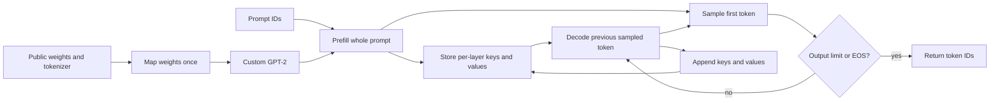

mini-infer measures KV caching, batching, paged allocation, int8 weight storage and HTTP serving in a small custom GPT-2 engine.

# mini-infer

A from-scratch GPT-2 inference engine in PyTorch, with exact Hugging Face parity checks and measured CPU KV-cache benchmarks.

**Current status: Milestone 7, streaming HTTP serving.** The custom GPT-2 transformer supports independent, fixed-batch, and FIFO continuous generation with request-owned caches, budgets, stop IDs, and seeded sampling. Public GPT-2 greedy outputs match independent engine/Hugging Face generation on CPU. Single-request KV-cache, mixed-request batching, and fixed-budget page-allocation and int8 measurements are published below; streaming serving and client latency measurements are now available.

## Quick start

Clone the standalone project:

```bash
git clone https://github.com/harshith49/mini-infer.git
cd mini-infer
```

From this project directory, with Python 3.11 installed:

```bash
python3.11 -m venv .venv && source .venv/bin/activate
python -m pip install -r requirements.txt
python -m engine.generate --prompt "Hello, world!" --max-new-tokens 50 --device cpu --use-cache
```

The first run downloads public GPT-2 small (~124M parameters) and its tokenizer into ignored `model_cache/`. No API key is needed. Downloads need internet access; subsequent runs reuse the cache. Two FP32 model instances briefly coexist while copying weights, so allow several GB of available RAM and about 600 MB of download/cache space.

Python 3.11.17, PyTorch 2.5.1, transformers 4.48.3, and pytest 8.3.5 were verified on macOS arm64. Python 3.11 is the recommended development version for these pins. CPU is the default fallback; `--device auto` selects CUDA when available, and `--device cuda` fails clearly if it is unavailable. Apple MPS is not supported by this milestone.

## Usage

```bash
python -m engine.generate --prompt "Once upon a time" --max-new-tokens 50 --use-cache
python -m engine.generate --prompt "Once upon a time" --max-new-tokens 50  # uncached baseline
python -m engine.generate --prompt "" --max-new-tokens 20 --device cpu
python -m pytest -q
```

The CLI stops on EOS, preserves the original prompt verbatim, and decodes only the new tokens. Generated special tokens are hidden; literal special-token text in the prompt is preserved. An empty prompt uses GPT-2's EOS/BOS seed. Prompt plus requested output must fit GPT-2's 1,024-token context. A zero-token request prints just the prompt. GPT-2 is a base language model, so repetition or unusual continuations are expected.

For already-downloaded weights, `HF_HUB_OFFLINE=1` prevents network checks. `--use-cache` separately selects inference KV caching; omitting it retains uncached generation. On this machine, `OMP_NUM_THREADS=1` works well for small CPU workloads; tune this on your hardware rather than treating it as a measured speedup.

Programmatic generation returns token IDs and can disable early stopping:

```python
from engine.config import EngineConfig
from engine.generate import generate
from engine.weights import load_model

model, tokenizer = load_model(EngineConfig(device="cpu"))
ids = tokenizer("Hello, world!", return_tensors="pt")["input_ids"]
output = generate(model, ids, 50, use_cache=True)  # no EOS stopping: exactly 50 new tokens
print(tokenizer.decode(output[0].tolist()))
```

## Static batching

Repeat `--prompt` to generate a fixed batch. Output is a JSON list in input order:

```bash
python -m engine.batching --prompt "Hello" --prompt "The quick brown fox" --max-new-tokens 50 --device cpu --use-cache
```

Omit `--use-cache` for the independent uncached execution path. Each original prompt is preserved verbatim, including Unicode, newlines, and literal special-token text. Empty text uses the same EOS/BOS seed as the single-request CLI.

```python
from engine.batching import generate_batch

prompts = [tokenizer(text, return_tensors="pt")["input_ids"][0].to(model.token_embedding.weight.device)
           for text in ["Hello", "The quick brown fox"]]
outputs = generate_batch(model, prompts, 50, pad_token_id=tokenizer.eos_token_id, use_cache=True)
# Outputs are rank-1 IDs, original unpadded prompt plus exactly 50 new tokens.
```

The API accepts nonempty rank-1 token tensors on the model device and a common output budget. Set `eos_token_id` to stop each row at its first generated EOS (included in the result). Finished rows keep their batch slots while other rows continue; their later filler is masked and excluded from results. Padding and genuine tokens may share an ID because the mask determines validity.

Prompts are left-padded, and learned positions count real tokens. Cache capacity is `longest_prompt_length + max_new_tokens` for every row, including padding; this full physical budget must fit the 1,024-token context. GPT-2 FP32 reservation is `batch_size × capacity × 73,728` bytes. The mixed-request cohort comparison below measures batch throughput; CPU process peak memory remains unmeasured.

## Continuous batching

```bash
python -m engine.scheduler --prompt "Hello" --prompt "The quick brown fox" --max-new-tokens 5 50 --max-batch-size 2 --device cpu
python -m engine.scheduler --prompt "Once upon a time" --max-new-tokens 30 --temperature 0.8 --top-k 20 --top-p 0.9 --seed 7
```

One budget broadcasts to all prompts; otherwise supply one per prompt. JSON results preserve submission order and original prompt text. Temperature zero is greedy. Positive temperature supports top-k then nucleus filtering. Each request owns its random generator; arrival order and other requests' seeds do not consume its random stream. Stochastic equality is checked on the same device, with no CPU/CUDA equality promise.

```python
from engine.scheduler import Scheduler
from engine.sampler import SamplingParams

scheduler = Scheduler(model, max_batch_size=2, pad_token_id=tokenizer.eos_token_id)
scheduler.submit("short", prompts[0], 5, stop_token_ids=(tokenizer.eos_token_id,))
scheduler.submit("long", prompts[1], 50, sampling=SamplingParams(seed=7))
while not scheduler.idle:
    for event in scheduler.step():
        print(event.request_id, event.token_id, event.finish_reason)
outputs = [scheduler.result(name) for name in ["short", "long"]]
```

The API returns unpadded prompt-plus-output IDs. Requests can arrive between steps. FIFO admission fills free slots; newly admitted requests prefill together, then previously running requests decode together. Completion frees slots for the next step. Events follow admission-then-decode order. Zero budgets complete without forwarding; multiple stop IDs are supported and the selected stop token stays in the result. Finite budgets and successful forwards ensure eventual FIFO admission.

Private caches reserve each request's prompt-plus-budget capacity and contain only real tokens. Decoding temporarily packs left-padded prefixes and copies back one new K/V column. Those copies and simultaneous private/temporary storage cost time and memory. `cache_allocated_bytes` reports current private storage; `peak_kv_bytes` includes simultaneous workspaces. Completed results remain until explicit `discard`, `cancel`, `close`, or disposal of the scheduler. The API has one synchronous owner. A forward failure leaves that phase retryable; events from an earlier successful phase are delivered once on the next successful step.

## Paged KV cache

```bash
python -m engine.scheduler --cache-backend paged --num-pages 32 --page-size 16 --prompt "Hello" --prompt "The quick brown fox" --max-new-tokens 5 50 --device cpu
```

Programmatically, construct `PagePool(model.config, num_pages=32, page_size=16, device=model.token_embedding.weight.device, dtype=model.token_embedding.weight.dtype)` from `engine.kv_cache` and pass it as `page_pool=pool` to `Scheduler`. One scheduler exclusively owns an initially free, matching pool. Direct `PagedKVCache(pool, capacity=...)` callers must explicitly `close()` their caches; closing is idempotent. Completion returns scheduler-owned pages, while pool tensors remain resident.

Positive requests reserve their entire prompt-plus-output budget, rounded up to whole pages, before prefill. Waiting requests own no pages; an individually impossible request rejects at submission. A page-blocked FIFO head prevents smaller waiters bypassing it, so some free space can sit idle while existing requests finish. Zero-output requests require no pages. Logical exhaustion queues requests; host tensor allocation errors still propagate. Failed staged allocation/prefill returns reserved pages, and existing phase-event recovery remains intact.

The PyTorch reference gathers only real prefix tokens per layer, copies them into the existing contiguous batch workspace, and scatters the new K/V column back. It provides allocation reuse, not a custom paged-attention kernel. `cache_allocated_bytes` counts owned page reservations, `pool_resident_bytes` counts the fixed pool, and `peak_kv_bytes` counts pool plus simultaneous workspace and one live gather pair without adding owned pages twice. Rounded tails and unused logical budgets are distinct costs. See the [page-table diagram](docs/architecture.md#paged-request-cache).

## Int8 transformer weights

```bash
python -m engine.generate --int8 --use-cache --device cpu --prompt "Hello, world!" --max-new-tokens 50
python -m engine.batching --int8 --use-cache --prompt "Hello" --prompt "The quick brown fox" --max-new-tokens 20
python -m engine.scheduler --int8 --cache-backend paged --num-pages 32 --prompt "Hello" --max-new-tokens 20
```

`EngineConfig(int8=True)` enables the same option programmatically. Each of GPT-2's 48 transformer projections stores int8 weights with one symmetric scale per output row. Every forward reconstructs the current layer into FP32 for ordinary floating matmul. Biases, normalization, embeddings and the tied vocabulary head remain FP32; KV caches also stay FP32. This inference-only reference reduces weight storage but adds reconstruction work. Move the model by device only; mixed-precision conversion/training is unsupported.

Quantized acceptance compares logits after subtracting each token's vocabulary mean: an additive vocabulary offset cancels in softmax. The bounds are centered maximum error 2.0 and RMSE 0.25; observed maxima across three prompts are 0.9081 and 0.07275. Raw errors remain documented (maximum 8.1086, RMSE 2.1856). This comparison was approved after diagnosing the failed raw-logit assumptions. The separate 5% perplexity-increase gate and original FP32 correctness tests remain unchanged.

## Architecture



The forward pass contains token and learned position embeddings, pre-norm transformer blocks, explicit causal multi-head attention, the GPT-2 GELU MLP, and final normalization. The vocabulary projection shares weights with token embeddings. Hugging Face Conv1D matrices are transposed into PyTorch Linear layout, including square attention projections.

The engine uses transformers only to load weights/configuration and tokenize text. Its forward pass and generation loop never execute a Hugging Face model. Tests execute Hugging Face as an independent reference. See [architecture](docs/architecture.md).

## Correctness

`tests/test_correctness_vs_hf.py` loads actual public `gpt2`, compares full FP32 logits using `atol=1e-4, rtol=1e-4`, and checks token-exact greedy decoding for **50 new tokens on each of three prompts**. Prompts cover punctuation, multiple lengths, Unicode, newlines, and spaces. Both models use evaluation mode; the reference uses eager attention and disables EOS stopping for fixed-length comparisons. The original baseline reference disables caching; batch acceptance also checks against cached HF generation.

Batch checks compare each row against independent engine and HF output for 50 tokens, in cached and uncached modes, including a prompt over 128 tokens, three prompt orders, and a single-row batch. Padded full and cached suffix logits match independent references at the same tolerance. Tiny models cover fully blocked leading queries, logical positions, independent EOS completion, padding invariance, invalid inputs, cache retry metadata, and logits lifetime.

On the verified CPU run, maximum absolute logit error was **0** for all three prompts. Cached token/chunk logits satisfy the same tolerance, and cached 50-token outputs match both the baseline and HF on all three prompts. The suite also tests offset causal masking, tied weights, checkpoint validation, cache capacity/byte accounting, failed-forward retry, context bounds, EOS termination, empty CLI prompts, and device selection. Public-weight tests are mandatory and fail if weights cannot be loaded. Only CUDA-specific tests skip when hardware is unavailable. CUDA numerical parity remains unverified here.

Scheduler acceptance adds 50-token public greedy comparisons with active limits one/two and staggered admission. Strict public suffix-logit checks cover each request’s first eight decodes, including the long prompt, at unchanged tolerances. Longer incremental FP32 histories can differ near zero from full-prefix reductions even inside HF on Apple M5; this numerical limitation is recorded in the lessons log. Tiny-model packing checks cover every decode, and original full-forward/cached checks remain unchanged.

Paged acceptance additionally checks all 50 direct cached suffix logits against contiguous cached execution at the same tolerance, nonconsecutive page reuse, poisoned tails, pressure-driven admission, seeded scheduling parity, and failed-forward page cleanup. The M4 additional public suffix gate stays unchanged.

Run the same suite after every later milestone. Preserve this uncached baseline to check optimizations independently. Quantization uses separate quality criteria because it can change greedy tokens.

## Roadmap and measurement status

| Stage | CPU measurements | GPU measurements | Status |
|---|---|---|---|
| Naive GPT-2 | 14.56 tokens/s | Not measured | Implemented and checked on CPU |
| KV cache | 108.49 tokens/s | Not measured | Implemented and checked on CPU |
| Static FIFO cohorts | 37.36 useful tokens/s* | Not measured | Implemented and checked on CPU |
| Continuous batching | 69.52 useful tokens/s* | Not measured | Implemented and checked on CPU |
| Paged KV | Capacity/fragmentation below; throughput unmeasured | Not measured | Implemented and checked on CPU |
| int8 transformer weights | 51.12% fewer weight bytes; 24.06 tokens/s** | Not measured | Implemented and checked on CPU |
| HTTP SSE serving | 128.25 / 114.37 tokens/s at concurrency 1 / 4*** | Not measured | Implemented and checked on CPU |

*Batch rows use the mixed workload below and are not comparable to the single-request values. Naive/KV representative values use **128 prompt tokens + 32 generated tokens**, GPT-2 FP32 on **Apple M5 CPU**, one PyTorch thread, one warmup, and three measured repetitions. Throughput includes prefill and cache allocation. These are instrumented synthetic token-ID workloads, not production traffic or GPU figures.

| Prompt tokens | CPU naive tokens/s | CPU cached tokens/s | Throughput ratio | Reserved cache MiB |
|---|---|---|---|---|
| 16 | 38.47 | 130.01 | 3.38× | 3.38 |
| 64 | 23.89 | 120.79 | 5.06× | 6.75 |
| 128 | 14.56 | 108.49 | 7.45× | 11.25 |
| 256 | 7.06 | 86.20 | 12.21× | 20.25 |

Full measurements: [results/kv_cache.csv](results/kv_cache.csv), including time to first token, decode p50/p95, hardware, and thread counts. First-token times stay similar because both modes must process the prompt. CPU peak process memory is **unmeasured**, not inferred from the cache size. GPU values remain unmeasured.

Run the benchmark (loading/tokenization are outside the timed intervals):

```bash
python -m benchmarks.bench_stages --device cpu
python -m benchmarks.bench_stages --device cuda --output results/kv_cache_cuda.csv
```

Optional flags: `--prompt-lengths 16 64 128 256`, `--max-new-tokens 32`, `--repetitions 3`, `--threads 1`. Output equality is checked before timing. Per-token instrumentation adds CPU timer calls and CUDA synchronization; this is an educational engine benchmark, not a serving load test.

- **KV cache:** reuse past keys and values instead of recomputing them. Costs memory that grows with sequence length and request count.
- **Static batching:** process several requests together to improve device utilization. Padding wastes work when lengths differ.
- **Continuous batching:** replace completed requests between decoding steps. Costs scheduling and per-request state management.
- **Paged KV:** reuse fixed-size blocks across requests, including nonconsecutive free pages. Full budgets remain reserved; rounding wastes space and PyTorch gathers add copies.
- **int8 weight-only quantization:** store linear weights with fewer bytes. Dequantization adds work and approximation can affect quality.
- **Streaming serving:** expose concurrent requests through a scheduler and SSE endpoint. Requires cancellation and lifecycle handling.

Naive-versus-KV and fixed-cohort-versus-continuous benchmarks are implemented. Streaming serving and client load measurements are implemented. Charts, HF/vLLM comparisons, Docker, CI, and a Colab notebook remain M8 work. Later results will include hardware, workload, latency, and memory context; GPU cells will stay unmeasured until actual GPU runs.

***HTTP rows use the text prompt and workload in the M7 section; they include delivery/parsing overhead and are single-run measurements.

## Mixed-request batching measurements

Apple M5 CPU, GPT-2 FP32, one PyTorch thread, active limit two, one warmup and three measured repetitions. Prompt lengths are `[16,64,32,128,16,64,32,128]`; requested output lengths are `[4,32,8,64,4,32,8,64]`. Both stages return the same **216 useful new tokens**, verified against independent cached generation.

| Stage | Useful tokens/s | Median seconds | Completion p50 / p95 ms | Extra static tokens | Peak K/V MiB |
|---|---|---|---|---|---|
| Static FIFO cohorts | 37.36 | 5.781 | 3343.83 / 5789.01 | 168 | 27.00 |
| Continuous batching | 69.52 | 3.107 | 1709.90 / 3106.13 | 0 | 45.98 |

Continuous batching measured **1.86× useful throughput** on this workload. The fixed-cohort comparator runs each pair to its largest budget, then trims outputs; continuous requests leave at their own budgets. This comparison does not claim a speedup on every workload. Temporary packed caches increase peak K/V storage even as fewer unnecessary tokens are computed. CPU process peak and GPU performance remain unmeasured.

Completion latency begins at common workload submission and ends at cohort return or completion-event delivery; these are whole-request percentiles, separate from the M2 per-token decode figures. Timers include validation, allocation, packing, prefill, sampling, and decoding, excluding loading/tokenization. The CSV records actual K/V tensors separately from process memory.

```bash
python -m benchmarks.bench_scheduler --device cpu
python -m benchmarks.bench_scheduler --device cuda --output results/continuous_batching_cuda.csv
```

Flags include `--prompt-lengths`, `--output-budgets`, `--max-batch-size`, `--repetitions`, and `--threads`. See [results/continuous_batching.csv](results/continuous_batching.csv). Earlier [KV-cache measurements](results/kv_cache.csv) are unchanged.

## Fixed-budget page measurements

The allocation-only CPU experiment uses GPT-2 FP32, page size 16, and a requested 32 MiB budget. Both stages use the same **31.5 MiB effective budget** (28 pages); the remaining 0.5 MiB cannot form another page. Real inference output equality is checked separately before allocation experiments. Throughput, latency and process peak memory are unmeasured here.

| Experiment | Contiguous | Paged |
|---|---|---|
| Clean capacity, repeated 17-token reservations | 26 requests; 31.08 MiB resident | 14 requests; 31.50 MiB resident |
| Rounded page tails in clean capacity | 0 MiB | 14.77 MiB |
| Fragmented trace: 224 free slots, largest hole 16, probe needs 32 | Probe rejected; 14 requests remain | Probe accepted using pages 0 and 2; 15 requests remain |

The clean trace deliberately crosses a page boundary: each 17-token request occupies 32 paged slots. Paging loses capacity here. The fragmented contiguous comparator is a **metadata first-fit arena**, not a measured PyTorch allocator; its resident-memory cell is blank. The paged comparator uses actual pool allocations. This demonstrates reuse of nonconsecutive free blocks, without claiming CUDA allocator behavior or a general capacity/speed improvement. All reservations have zero committed K/V in these allocation traces.

```bash
python -m benchmarks.bench_paged --device cpu
```

Flags include `--budget-mib`, `--page-size`, `--capacities`, `--threads`, and `--output`. [results/paged_cache.csv](results/paged_cache.csv) includes model configuration, budgets, allocation kinds, replayable traces and byte scopes. Earlier M2/M4 CSVs are unchanged.

## Int8 memory, speed and quality measurements

An isolated Apple M5 CPU run used GPT-2, one thread, one warmup and three repetitions, 32 generated tokens, the same seed-zero prompts in both stages, and cached generation. The same exclusively owned model was measured in FP32, then converted in place. Loading, conversion and quality evaluation were outside generation timers.

| Prompt tokens | FP32 cached tokens/s | Int8 cached tokens/s | Int8 / FP32 throughput |
|---|---|---|---|
| 16 | 110.13 | 28.78 | 0.26× |
| 64 | 102.01 | 30.85 | 0.30× |
| 128 | 89.02 | 24.06 | 0.27× |
| 256 | 70.10 | 25.65 | 0.37× |

**The int8 reference is slower on this CPU.** Weight storage falls from **474.70 to 232.02 MiB (51.12%)**, including scales and floating parameters and counting the tied embedding/head once. Including causal masks, resident model tensors total 486.70 versus 244.02 MiB. Maximum one-layer reconstruction is 9 MiB, an analytic temporary tensor size, not process peak. KV reservation is unchanged. CPU process/ conversion peaks and CUDA performance are unmeasured. The roadmap's int8 speed (** above) uses 128 prompt + 32 output tokens from this paired run; older milestone measurements have their own run context.

Quality uses a pinned, checksum-verified runtime download of [Tiny Shakespeare](https://github.com/karpathy/char-rnn/tree/370cbcd448eb7daf32f21a6be560b70e0b33c4e3/data/tinyshakespeare). The first 4,097 GPT-2 tokens produce 4,096 scored targets, context 1,024 and stride 512; overlapping context is not rescored. FP32 perplexity is **71.1282**, int8 **70.1133** (1.43% lower on this slice). This passes the planned 5% maximum increase gate, but does not establish broad quality improvement. Greedy tokens may differ from FP32.

```bash
python -m benchmarks.bench_quantization --device cpu
```

The first run downloads public weights and text into ignored `model_cache/`. Later runs support `HF_HUB_OFFLINE=1`; missing/corrupt quality data fails clearly. Flags include `--prompt-lengths`, `--max-new-tokens`, `--repetitions`, `--threads`, `--quality-tokens`, `--context`, `--stride`, and `--output`. [results/quantization.csv](results/quantization.csv) records source/revision/checksums, scoring windows, bytes, quality and timing scopes. Earlier CSVs are unchanged.

## Honest limitations

This is a learning project, not production-ready. Only standard GPT-2 inference is implemented; TinyLlama/RoPE/RMSNorm/SwiGLU/GQA are future work. Generation supports single requests, static batches with a shared budget, and continuous requests with individual budgets/stops/sampling. The default baseline recomputes the full prefix; cached paths reserve contiguous storage by default, with optional paged private caches in the scheduler. Attention still reads the full prefix, and continuous batching copies temporary packed caches every step. No custom kernels, distributed execution, cancellation, asynchronous worker, or server exist yet. No comparison against vLLM has been measured.

## What I learned / what broke

[The lessons log](docs/lessons.md) records actual implementation problems, fixes, and verification results. The [Milestone 1 design](docs/superpowers/specs/2026-10-05-mini-infer-m1-design.md) and [implementation plan](docs/superpowers/plans/2026-10-05-mini-infer-m1.md) explain the baseline scope. The [Milestone 2 design](docs/superpowers/specs/2026-10-05-mini-infer-m2-design.md) and [plan](docs/superpowers/plans/2026-10-05-mini-infer-m2.md) cover cached generation and measurements. The [Milestone 3 design](docs/superpowers/specs/2026-10-05-mini-infer-m3-design.md) and [plan](docs/superpowers/plans/2026-10-05-mini-infer-m3.md) cover static batching. The [Milestone 4 design](docs/superpowers/specs/2026-10-06-mini-infer-m4-design.md) and [plan](docs/superpowers/plans/2026-10-06-mini-infer-m4.md) cover scheduling and its measurements.

The [Milestone 5 design](docs/superpowers/specs/2026-10-06-mini-infer-m5-design.md) and [plan](docs/superpowers/plans/2026-10-06-mini-infer-m5.md) cover page ownership, recovery and allocation measurements.

The [Milestone 6 design](docs/superpowers/specs/2026-10-06-mini-infer-m6-design.md) and [plan](docs/superpowers/plans/2026-10-06-mini-infer-m6.md) cover int8 conversion and its quality/measurement gates.

The [Milestone 7 design](docs/superpowers/specs/2026-10-10-mini-infer-m7-design.md) and [plan](docs/superpowers/plans/2026-10-10-mini-infer-m7.md) cover HTTP streaming, request cleanup and client measurement.

Code license: [MIT](LICENSE). Downloaded weights remain subject to their upstream license and are not included in this repository.

## Streaming HTTP generation (M7)

Start one local model worker, then stream tokens from another terminal:

```bash
python -m server.app --device cpu --threads 1 --max-batch-size 2
curl -N http://127.0.0.1:8000/v1/generate \
  -H 'Content-Type: application/json' \
  -d '{"prompt":"The future of machine learning is","max_new_tokens":32,"stop_token_ids":[]}'
```

The POST accepts `prompt` (required, up to 65,536 characters), `max_new_tokens` (default 50), `temperature` (0), `top_k` (0), `top_p` (1), `seed` (0), and `stop_token_ids` (EOS by default; `[]` disables stopping). Unknown fields, type coercions, nonfinite sampling values and prompt-plus-output overflow reject with JSON 422 before SSE headers. Empty text uses one EOS seed and zero budget is valid. Capacity exhaustion returns 429; an unavailable/failed worker returns 503.

Every selected token emits `event: token` with JSON `request_id`, `token_id`, and `delta`. `event: done` contains the same ID, generated-only `token_ids`, original-prompt-plus-generated `text`, `finish_reason` (`length` or `stop`), `usage` (`prompt_tokens`, `completion_tokens`, `total_tokens`), and `server_peak_forward_batch_size`. Stop IDs count in usage, even when decoded special-token text is empty. Runtime failure sends `event: error` with a stable code/message and closes without a final `done`; restart the server after a worker failure.

Append token deltas to build text. A byte-split Unicode character or a literal trailing replacement character can delay a delta; empty deltas still carry valid token IDs. The finishing token flushes all remaining decoded text. The original prompt is preserved verbatim, and the artificial seed for empty prompts is counted but hidden.

One background thread owns inference and enables overlapping requests to share scheduler batches. Default outstanding-stream limit is 64 (`--max-outstanding`), including completed but undrained streams. Token budgets bound each response queue; slow consumers cannot block another generation. Disconnect cleanup returns request pages/state and releases the slot after worker acknowledgment. Cancellation and shutdown allow the current forward to finish. Use the supported module command for coordinated shutdown; a permanently stuck backend needs process termination. This milestone runs one process and has no reconnect/session protocol.

Use `--cache-backend paged --num-pages 32 --page-size 16` or `--int8` to reuse the existing engine options. Requests with positive output budgets must individually fit a paged pool. `--device auto` selects available CUDA or CPU; CUDA serving remains unmeasured on this host.

Run the validated load test after starting the server. Hardware/device/cache flags describe the server you launched and are labeled operator-declared in the CSV:

```bash
python -m benchmarks.load_test --requests 8 --concurrency 1 \
  --server-device cpu --server-hardware 'Apple M5' --server-threads 1 \
  --server-max-batch-size 2 --server-cache-backend contiguous
python -m benchmarks.load_test --requests 8 --concurrency 4 \
  --server-device cpu --server-hardware 'Apple M5' --server-threads 1 \
  --server-max-batch-size 2 --server-cache-backend contiguous
```

Each run warms up separately, then requests exactly 32 outputs with seed zero/no EOS stop. Useful tokens divided by first-launch-to-last-finish elapsed time give throughput. Whole-request latency and first-token arrival use p50/p95 linear-interpolated percentiles; zero-token requests have no TTFT sample. HTTP, timeout, malformed/truncated SSE and mismatched final results fail the run without appending a successful row. The reported batch peak covers the server lifetime, including warmup/previous runs; it does not establish the peak of that individual workload.

Measured on Apple M5 CPU, one thread, FP32/contiguous KV, batch limit 2; each row has 8 requests and 256 useful output tokens, with a separate warmup:

| Client concurrency | Tokens/s | Request latency p50 / p95 | TTFT p50 / p95 | Lifetime batch peak |
| --- | ---: | ---: | ---: | ---: |
| 1 | 128.25 | 247.88 / 253.07 ms | 16.13 / 16.72 ms | 1 |
| 4 | 114.37 | 1,115.17 / 1,130.25 ms | 582.07 / 593.85 ms | 2 |

Raw data: [serving.csv](results/serving.csv). These are two single-run smoke measurements, not repeated benchmark medians. The concurrent run achieved real batching but lower throughput and higher client latency on this CPU. They include delivery overhead and use a different workload from prior engine-only CSVs; CPU process peak memory and CUDA performance are unmeasured.
