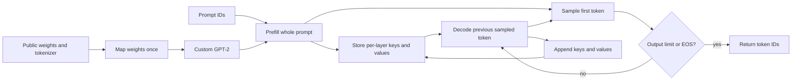

LLM serving wastes GPU time and memory. mini-infer is a from-scratch engine that shows exactly how to reclaim both, with every optimization measured.

# mini-infer

A from-scratch GPT-2 inference engine in PyTorch, with exact Hugging Face parity checks and measured CPU KV-cache benchmarks.

**Current status: Milestone 3, static batching.** The custom GPT-2 transformer supports independent and fixed-batch generation, with optional contiguous KV caching. Different-length batch rows match independent Hugging Face greedy tokens on CPU. Naive-versus-cached single-request CPU measurements are published below; batch throughput remains unmeasured and serving comes later.

## Quick start

Clone the standalone project:

```bash
git clone https://github.com/harshith49/mini-infer.git
cd mini-infer
```

From this project directory, with Python 3.11 installed:

```bash
python3.11 -m venv .venv && source .venv/bin/activate
python -m pip install -r requirements.txt
python -m engine.generate --prompt "Hello, world!" --max-new-tokens 50 --device cpu --use-cache
```

The first run downloads public GPT-2 small (~124M parameters) and its tokenizer into ignored `model_cache/`. No API key is needed. Downloads need internet access; subsequent runs reuse the cache. Two FP32 model instances briefly coexist while copying weights, so allow several GB of available RAM and about 600 MB of download/cache space.

Python 3.11.17, PyTorch 2.5.1, transformers 4.48.3, and pytest 8.3.5 were verified on macOS arm64. Python 3.11 is the recommended development version for these pins. CPU is the default fallback; `--device auto` selects CUDA when available, and `--device cuda` fails clearly if it is unavailable. Apple MPS is not supported by this milestone.

## Usage

```bash
python -m engine.generate --prompt "Once upon a time" --max-new-tokens 50 --use-cache
python -m engine.generate --prompt "Once upon a time" --max-new-tokens 50  # uncached baseline
python -m engine.generate --prompt "" --max-new-tokens 20 --device cpu
python -m pytest -q
```

The CLI stops on EOS, preserves the original prompt verbatim, and decodes only the new tokens. Generated special tokens are hidden; literal special-token text in the prompt is preserved. An empty prompt uses GPT-2's EOS/BOS seed. Prompt plus requested output must fit GPT-2's 1,024-token context. A zero-token request prints just the prompt. GPT-2 is a base language model, so repetition or unusual continuations are expected.

For already-downloaded weights, `HF_HUB_OFFLINE=1` prevents network checks. `--use-cache` separately selects inference KV caching; omitting it retains uncached generation. On this machine, `OMP_NUM_THREADS=1` works well for small CPU workloads; tune this on your hardware rather than treating it as a measured speedup.

Programmatic generation returns token IDs and can disable early stopping:

```python
from engine.config import EngineConfig
from engine.generate import generate
from engine.weights import load_model

model, tokenizer = load_model(EngineConfig(device="cpu"))
ids = tokenizer("Hello, world!", return_tensors="pt")["input_ids"]
output = generate(model, ids, 50, use_cache=True)  # no EOS stopping: exactly 50 new tokens
print(tokenizer.decode(output[0].tolist()))
```

## Static batching

Repeat `--prompt` to generate a fixed batch. Output is a JSON list in input order:

```bash
python -m engine.batching --prompt "Hello" --prompt "The quick brown fox" --max-new-tokens 50 --device cpu --use-cache
```

Omit `--use-cache` for the independent uncached execution path. Each original prompt is preserved verbatim, including Unicode, newlines, and literal special-token text. Empty text uses the same EOS/BOS seed as the single-request CLI.

```python
from engine.batching import generate_batch

prompts = [tokenizer(text, return_tensors="pt")["input_ids"][0].to(model.token_embedding.weight.device)
           for text in ["Hello", "The quick brown fox"]]
outputs = generate_batch(model, prompts, 50, pad_token_id=tokenizer.eos_token_id, use_cache=True)
# Outputs are rank-1 IDs, original unpadded prompt plus exactly 50 new tokens.
```

The API accepts nonempty rank-1 token tensors on the model device and a common output budget. Set `eos_token_id` to stop each row at its first generated EOS (included in the result). Finished rows keep their batch slots while other rows continue; their later filler is masked and excluded from results. Padding and genuine tokens may share an ID because the mask determines validity.

Prompts are left-padded, and learned positions count real tokens. Cache capacity is `longest_prompt_length + max_new_tokens` for every row, including padding; this full physical budget must fit the 1,024-token context. GPT-2 FP32 reservation is `batch_size × capacity × 73,728` bytes. Batch speedup and process peak memory have not been measured.

## Architecture



The forward pass contains token and learned position embeddings, pre-norm transformer blocks, explicit causal multi-head attention, the GPT-2 GELU MLP, and final normalization. The vocabulary projection shares weights with token embeddings. Hugging Face Conv1D matrices are transposed into PyTorch Linear layout, including square attention projections.

The engine uses transformers only to load weights/configuration and tokenize text. Its forward pass and generation loop never execute a Hugging Face model. Tests execute Hugging Face as an independent reference. See [architecture](docs/architecture.md).

## Correctness

`tests/test_correctness_vs_hf.py` loads actual public `gpt2`, compares full FP32 logits using `atol=1e-4, rtol=1e-4`, and checks token-exact greedy decoding for **50 new tokens on each of three prompts**. Prompts cover punctuation, multiple lengths, Unicode, newlines, and spaces. Both models use evaluation mode; the reference uses eager attention and disables EOS stopping for fixed-length comparisons. The original baseline reference disables caching; batch acceptance also checks against cached HF generation.

Batch checks compare each row against independent engine and HF output for 50 tokens, in cached and uncached modes, including a prompt over 128 tokens, three prompt orders, and a single-row batch. Padded full and cached suffix logits match independent references at the same tolerance. Tiny models cover fully blocked leading queries, logical positions, independent EOS completion, padding invariance, invalid inputs, cache retry metadata, and logits lifetime.

On the verified CPU run, maximum absolute logit error was **0** for all three prompts. Cached token/chunk logits satisfy the same tolerance, and cached 50-token outputs match both the baseline and HF on all three prompts. The suite also tests offset causal masking, tied weights, checkpoint validation, cache capacity/byte accounting, failed-forward retry, context bounds, EOS termination, empty CLI prompts, and device selection. Public-weight tests are mandatory and fail if weights cannot be loaded. Only CUDA-specific tests skip when hardware is unavailable. CUDA numerical parity remains unverified here.

Run the same suite after every later milestone. Preserve this uncached baseline to check optimizations independently. Quantization will use separate quality criteria because it can change greedy tokens.

## Roadmap and measurement status

| Stage | CPU measurements | GPU measurements | Status |
|---|---|---|---|
| Naive GPT-2 | 14.56 tokens/s | Not measured | Implemented and checked on CPU |
| KV cache | 108.49 tokens/s | Not measured | Implemented and checked on CPU |
| Static batching | Not measured | Not measured | Implemented and checked on CPU |
| Continuous batching | Not measured | Not measured | Planned |
| Paged KV | Not measured | Not measured | Planned |
| int8 weights | Not measured | Not measured | Planned |

Representative stage values above use **128 prompt tokens + 32 generated tokens**, GPT-2 FP32 on **Apple M5 CPU**, one PyTorch thread, one warmup, and three measured repetitions. Throughput includes prefill and cache allocation. These are instrumented synthetic token-ID workloads, not production traffic or GPU figures.

| Prompt tokens | CPU naive tokens/s | CPU cached tokens/s | Throughput ratio | Reserved cache MiB |
|---|---|---|---|---|
| 16 | 38.47 | 130.01 | 3.38× | 3.38 |
| 64 | 23.89 | 120.79 | 5.06× | 6.75 |
| 128 | 14.56 | 108.49 | 7.45× | 11.25 |
| 256 | 7.06 | 86.20 | 12.21× | 20.25 |

Full measurements: [results/kv_cache.csv](results/kv_cache.csv), including time to first token, decode p50/p95, hardware, and thread counts. First-token times stay similar because both modes must process the prompt. CPU peak process memory is **unmeasured**, not inferred from the cache size. GPU values remain unmeasured.

Run the benchmark (loading/tokenization are outside the timed intervals):

```bash
python -m benchmarks.bench_stages --device cpu
python -m benchmarks.bench_stages --device cuda --output results/kv_cache_cuda.csv
```

Optional flags: `--prompt-lengths 16 64 128 256`, `--max-new-tokens 32`, `--repetitions 3`, `--threads 1`. Output equality is checked before timing. Per-token instrumentation adds CPU timer calls and CUDA synchronization; this is an educational engine benchmark, not a serving load test.

- **KV cache:** reuse past keys and values instead of recomputing them. Costs memory that grows with sequence length and request count.
- **Static batching:** process several requests together to improve device utilization. Padding wastes work when lengths differ.
- **Continuous batching:** replace completed requests between decoding steps. Costs scheduling and per-request state management.
- **Paged KV:** allocate cache in fixed-size blocks to reduce reservation waste. Costs page-table bookkeeping and, in a PyTorch reference, gathers.
- **int8 weight-only quantization:** store linear weights with fewer bytes. Dequantization adds work and approximation can affect quality.
- **Streaming serving:** expose concurrent requests through a scheduler and SSE endpoint. Requires cancellation and lifecycle handling.

Only the naive-versus-KV benchmark is implemented. Charts, HF/vLLM comparisons, the streaming server, Docker, CI, and a Colab notebook are not implemented yet. Later results will include hardware, workload, latency, and memory context; GPU cells will stay unmeasured until actual GPU runs.

## Honest limitations

This is a learning project, not production-ready. Only standard GPT-2 inference is implemented; TinyLlama/RoPE/RMSNorm/SwiGLU/GQA are future work. Generation handles one unpadded request. The default baseline recomputes the full prefix; `--use-cache` enables fixed-capacity contiguous request storage. Caching still reads previous keys and values, reserves the full requested budget, and has no paging or scheduler. No custom kernels, distributed execution, stochastic sampling, quantization, or server exist yet. No comparison against vLLM has been measured.

## What I learned / what broke

[The lessons log](docs/lessons.md) records actual implementation problems, fixes, and verification results. The [Milestone 1 design](docs/superpowers/specs/2026-10-05-mini-infer-m1-design.md) and [implementation plan](docs/superpowers/plans/2026-10-05-mini-infer-m1.md) explain the baseline scope. The [Milestone 2 design](docs/superpowers/specs/2026-10-05-mini-infer-m2-design.md) and [plan](docs/superpowers/plans/2026-10-05-mini-infer-m2.md) cover cached generation and measurements. The [Milestone 3 design](docs/superpowers/specs/2026-10-05-mini-infer-m3-design.md) and [plan](docs/superpowers/plans/2026-10-05-mini-infer-m3.md) cover static batching.

Code license: [MIT](LICENSE). Downloaded weights remain subject to their upstream license and are not included in this repository.
