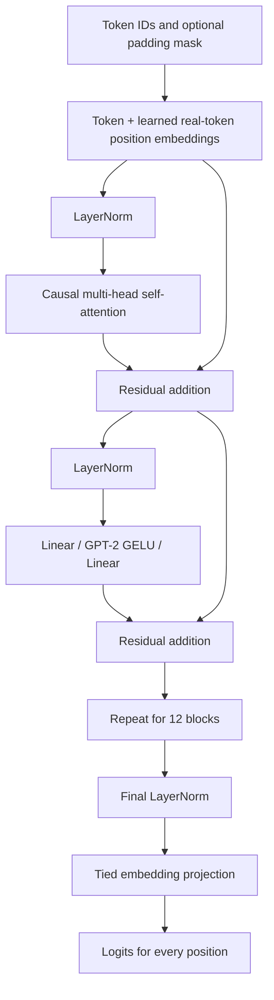
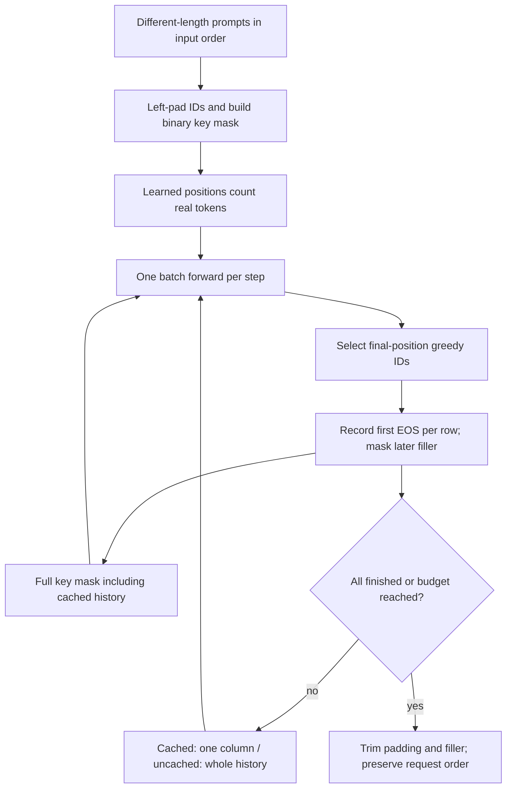
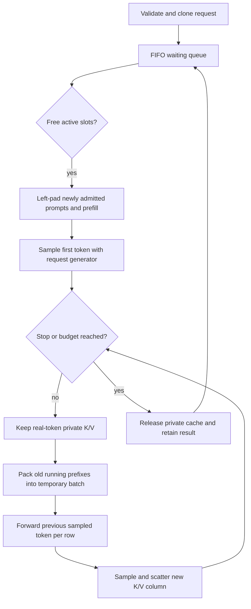

# Transformer and KV-cache architecture

The engine implements GPT-2 small using PyTorch tensors and modules. Hugging Face is the loading and correctness boundary, not the inference runtime.



Each attention head computes `softmax(QKᵀ / sqrt(head_dim))V`. Queries and keys have shape `[batch, heads, tokens, head_dim]`. A lower-triangular mask removes future keys before softmax; an optional binary key mask also removes padding. Fully blocked leading padded queries have zero attention probabilities and finite outputs. Without a mask, position IDs are physical indices; with a mask, they count real tokens starting at zero. Explicit per-row position IDs can override this derivation.

GPT-2's Hugging Face Conv1D weights use `[input, output]`; PyTorch Linear uses `[output, input]`. `weights.py` first rejects HF loading diagnostics that indicate absent/randomly initialized parameters, then validates the entire mapping before copying, transposing all projection weights even when square. Embedding and normalization weights copy directly. The language-model head shares the token embedding parameter rather than storing a second vocabulary matrix.

```mermaid
sequenceDiagram
    participant Request
    participant Loop as Uncached generation
    participant Model as Custom GPT-2
    Request->>Loop: Prompt and output budget
    Loop->>Loop: Validate tokens and context capacity
    loop Until output limit or EOS
        Loop->>Model: Entire prompt and all generated tokens
        Model-->>Loop: Full sequence logits
        Loop->>Loop: Argmax final-position logits; append ID
    end
    Loop-->>Request: Prompt plus new token IDs
```

The first forward processes the prompt. Each later forward processes the growing sequence again. The uncached baseline intentionally retains this repeated work as an independent correctness oracle. Milestone 2 adds an optional cached path that separates **prefill**, which processes the prompt once, from **decode**, which processes one new token with saved keys and values.

`generate()` reserves prompt length plus the full requested output budget, even if EOS might arrive earlier. It accepts one request, returns terminal EOS when configured, and runs under inference mode. With no EOS stop ID, it produces exactly the requested count. The CLI supplies GPT-2 EOS as the stop ID and uses the same token as a seed for an empty prompt.

Loading temporarily holds an HF checkpoint and a custom model, copies weights, releases the HF object, and moves the custom model to CPU or CUDA in evaluation mode. No HF object is retained as a model child. Exceptions preserve download/checkpoint context rather than falling back to random weights.

`tests/test_correctness_vs_hf.py` verifies actual public weights. Its synthetic tiny checkpoint checks are fast diagnostics, never replacements for the public-model acceptance tests. The eager HF attention backend is the transparent FP32 comparison; CUDA backend numerical behavior must be checked on actual CUDA hardware.

## Contiguous request cache

```mermaid
sequenceDiagram
    participant Request
    participant Model as Custom GPT-2
    participant Cache as Request KV cache
    Request->>Cache: Allocate prompt + output capacity
    Request->>Model: Prefill whole prompt
    Model->>Cache: Write each layer's K/V, then commit length
    Model-->>Request: First new token from final prompt logits
    loop Remaining output tokens
        Request->>Model: Previous sampled token only
        Model->>Cache: Append layer K/V; read committed prefix + new token
        Model->>Cache: Commit length once after logits succeed
        Model-->>Request: Next token
    end
```

`SimpleKVCache` owns key and value tensors with shape `[layers, batch, heads, capacity, head_dim]`. It is separate from the model/checkpoint. GPT-2 FP32 cache storage costs `2 × 12 × 768 × 4 = 73,728` bytes per reserved token per request. Capacity is fixed for the request, so **allocated bytes** stay constant while **used bytes** grow with committed token count. Normal generation reserves prompt plus output budget; the last sampled token need not be forwarded, so it does not need a committed KV slot. EOS may leave more unused capacity.

Without a padding mask, absolute position IDs start at `cache.length`. A chunk of length `n` after a physical prefix of length `p` uses causal-mask rows `p:p+n` and key columns `:p+n`. Using rows starting at zero would wrongly hide past keys and mis-mask a multi-token chunk. With a mask, learned positions count valid tokens separately from physical cache length. Both one-token decode and chunked prefill are tested.

Every layer writes tentatively at the same committed offset; the model advances the length only after the final logits succeed. A failed late layer leaves the earlier committed prefix intact. Retrying overwrites tentative slots. Dimensions, batch, dtype/device, and capacity are validated before the first write. This cache stores inference state and does not support differentiable training through cached keys/values.

Caching saves repeated projections and MLP computation for old tokens, but attention still reads all previous keys and values. Contiguous allocation reserves the full request budget, including padding in static batches. M4 schedules admission and completion; paging will address reservation and fragmentation.

## Fixed-batch generation



`generate_batch()` validates every prompt, token ID, and physical output budget before allocating or forwarding. It left-pads to the longest prompt, reserves that width plus the shared output budget for each row, and keeps the batch fixed. With EOS disabled each row gets exactly the requested count; otherwise each row includes its own first new EOS and excludes subsequent filler. Zero outputs return original prompt tensors without a forward or cache allocation. Previous vocabulary logits are released before the next forward in both modes.

The masked model API requires a same-device Boolean or integer 0/1 mask covering all physical keys, including the committed cache prefix. Each row must have a real key; chunked prefill that contains only padding for a row is rejected. Derived positions are `cumsum(mask) - 1`, with masked positions set to zero, taking the new chunk suffix. Explicit positions are same-device `torch.long` tensors matching the current input shape and learned range.

After masked keys commit, `cache.requires_attention_mask` prevents later calls from exposing them by omitting the mask. This flag commits with length after successful logits, and a failed forward leaves committed metadata/prefix reusable. The caller must preserve historical key validity: changing an old mask is unsupported because cached hidden states were computed under that mask. The batch loop owns the full mask history; the cache does not store another mask tensor.

Allocated/used byte counts include physical padding and forwarded filler slots, even though masked slots cannot influence valid tokens. The static API keeps fixed rows and a common budget. The separate M4 scheduler handles admission and per-request budgets.

## Measurement scope

`benchmarks/bench_stages.py` runs the same deterministic synthetic token IDs and fixed greedy output count through both stages, checking output equality before timing. Total generation time includes request validation, cache allocation, prefill, sampling, and decode; model/tokenizer loading and text tokenization are outside it. One warmup precedes three or more measured repetitions.

The optional `step_times` collector synchronizes CUDA only when measuring. Its first duration is time to the first generated token; later durations supply decode p50/p95. A one-token output has no decode samples, so those fields stay blank. Throughput is output-token count divided by median total generation time. Instrumentation adds timer calls on CPU and per-step synchronization on CUDA; compare these as instrumented engine measurements, not production serving results.

CPU process peak memory is unmeasured and left blank. Cache reserved bytes are actual tensor storage, not total process memory. CUDA peak memory, when run there, is PyTorch allocated tensor memory including resident model weights, excluding tokenizer/process RAM and driver reservations. Hardware and thread counts travel with each CSV row.

## Continuous batching and sampling



A step snapshots the existing running set, prefills new admissions into free slots, then decodes only the old snapshot. Newly admitted rows receive one token, not two. Free slots from this step are reused next step. Zero-budget admissions use no active slot. Admission events precede decode events; completed IDs cannot be reused during one scheduler lifetime. The scheduler is synchronous, single-owner, and retains completed token results.

Each private cache has batch size one and capacity `prompt length + output budget`. Admission uses a temporary cache sized to the longest prompt; only real prompt K/V is retained. A request completing on its first selected token allocates no private cache. Decode packs left-aligned physical padding before each shorter real prefix, with zero-initialized masked slots, a full validity mask, and positions counting only valid tokens. Temporary capacity is largest committed prefix plus one. After successful logits, copy only the new column back. The final selected token is never forwarded unnecessarily.

The model commits only the temporary cache. A model-forward fault therefore leaves private prefixes, outputs, and generators unchanged for the failed phase. Previously successful admission remains committed, with undelivered events retained for the next successful call. This is phase recovery; callers decide whether to retry. Nonfinite weights/sampling faults or allocation failure during commit are outside this model-forward recovery contract.

`SamplingParams` validates finite temperature/top-p, vocabulary-bounded top-k, and a supported seed. Temperature zero uses greedy argmax without RNG consumption. For positive temperature, center logits before scaling, keep exact top-k candidates, and apply cumulative nucleus filtering including the threshold-crossing candidate. `torch.multinomial` uses the request's device generator; global randomness is untouched. Tiny positive temperatures are handled without invalidating the largest finite score.

`benchmarks/bench_scheduler.py` compares fixed FIFO cohorts using their maximum budget with continuous requests using individual budgets. Static outputs are trimmed to useful requested tokens; excess static work is reported separately. Both stages are checked against independent cached generation before measurement. Total time includes submission, allocation, prefill, sampling, packing and decoding. Completion p50/p95 runs from common workload submission to cohort return or completion-event delivery; this differs from M2 per-token decode latency. CUDA timed boundaries and event delivery synchronize. Peak K/V counts include simultaneous private and temporary tensors; CPU process peak stays unmeasured.
